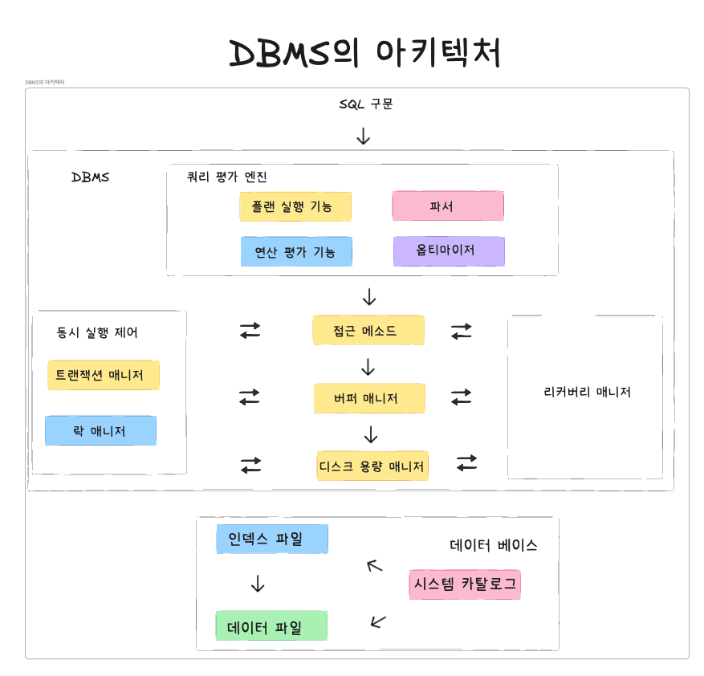

## 🛠️ 아키텍처 개요
현재 다양한 DBMS(Oracle, MySQL, PostSQL,MS SQL)등이 존재하며, 각 제품은 각각의 특징이 존재합니다. 따라서 내부의 아키텍처는 조금씩 다르지만, **RDBMS으로써의 기능을 제공한다는 점**은 공통적으로 가지고 있습니다. 이에 공통적인 구조를 이해한다면, 각각의 DBMS가 가지는 특징도 쉽게 파악을 할 수 있습니다.

### DBMS의 일반적인 아키텍처 개요
일반 사용자 혹은 프로그래머가 SQL 구문을 입력한다면, **중간의 DBMS는 다양한 처리를 수행하여 저장장치에 있는 데이터에 접근하여 데이터를 읽고 쓰게 됩니다.**
 

#### 1. 쿼리 평가 엔진
쿼리 평가 엔진은 **사용자로부터 입력받은 SQL 구문을 분석하고, 어떤 순서로 기억장치의 데이터에 접근할지를 결정**합니다. 쿼리 평가 엔진에 의해 결정되는 계획을 **실행 계획** 혹은 **실행 플랜**이라고 부릅니다.
DBMS는 **생성된 실행계획에 따라 데이터에 접근하는 방법**을 **접근 메소드**라고 합니다.
 

#### 2. 버퍼 매니저
DBMS는 **버퍼라는 메모리 영역을 확보**해두며, 해당 메모리를 관리하는 역할을 담당하는 것이 **버퍼 매니저**입니다. 버퍼 매니저는 **디스크 용량 매니저와 함께 연동**되어 작동합니다.
 

#### 3. 디스크 용량 매니저
데이터베이스는 **데이터를 영구적으로 저장해야 함으로 디스크 용량 매니저를 통해 데이터를 어디에 어떻게 저장할지를 관리하며, 데이터의 읽기와 쓰기를 제어**합니다.
 

#### 4. 트랜잭션 매니저와 락 매니저
수많은 사람들이 동시에 데이터베이스에 접근하여 사용하게 되며, 이때 각각의 처리는 DBMS 내부에서 **트랜잭션**이라는 단위로 관리됩니다. 이때 **트랜잭션의 정합성을 유지하면서 실행시키고, 필요한 경우 데이터에 락을 걸어 다른 사람의 요청을 대기시키는 것**이 **트랜잭션 매니저**와 **락 매니저의 역할**입니다.
 

➕ 트랜잭션의 정의
- 트랜잭션은 **데이터베이스의 논리적인 작업 단위**로, 데이터 연산을 묶어 **원자성(Atomicity), 일관성(Consistency), 고립성(Isolation), 지속성(Durability)라는 ACID의 특성을 보장**합니다.
 

**ACID의 특성**

원자성
- 모든 작업이 성공하거나, 모두 실패함을 보장합니다.

일관성
- 데이터베이스의 규칙과 제약 조건을 항상 만족하도록 보장합니다.

고립성
- 동시 실행되는 트랜잭션 간 간섭을 방지합니다.

지속성
- 트랜잭션 완료 후에 결과가 영구적으로 저장됨을 보장합니다.
 

#### 5. 리커버리 매니저
DBMS는 저장하고 있는 데이터 중 절대 잃어버려서는 안되는 데이터가 저장되어 있습니다. 하지만 시스템은 언제나 장애가 발생할 수 있으며, 해당 상황을 방지하기 위해 **데이터를 정기적으로 백업하고 문제 발생 시 복구하기 위한 리커버리 매니저가 존재**합니다.

